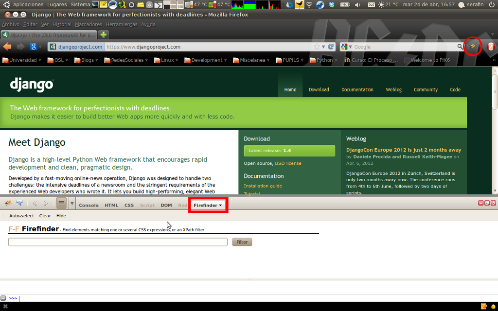

##Introducción
En este módulo vamos a ver qué trata esta técnica de programación, a la que se le puede sacar mucho partido y puede dar mucho juego para hacer aplicaciones.
Acabando el módulo con un ejercicio simple de hacer, así que empecemos.


###¿Qué es el scraping?
Os preguntaréis ¿qué es eso del scraping? Pues el scraping (traduciendo del inglés sería como “raspar algo”) en general es una técnica para obtener información de diferentes medios, lo que podemos denominar como Data scraping.

Pues bien hay varios términos que podemos diferenciar en el mundo del scraping como son:

* Screen scraping.
Es la técnica con la que podemos obtener la información de un dispositivo gráfico, como ejemplo hipotético pongámonos en aquellos años de 1950 donde se usaban pantallas informativas, unos simples terminales que mostraban información. Pues para recabar esos datos tendríamos que diseñar un sistema el cual podríamos conectar mediante algún protocolo y emular las pulsaciones para movernos por el texto mostrado obteniendo lo que nos interese y enviando esta información a un sistema moderno para procesarla.

* Web scraping.
Es una técnica muy común (de hecho es sobre la que nos vamos a centrar en este módulo de scraping) ya que de lo que trata es obtener la información de un recurso como por ejemplo de una página web en HTML y procesar esa información.

* Report mining.
Al igual que el web scraping y el screen scraping es otra técnica que también pretende obtener información pero en este caso a partir de un archivo (HTML, RDF, CSV, etc). Así con esta aproximación de definición podemos crear un mecanismo simple y rápido sin necesidad de escribir una API y como característica principal podemos indicar que el sistema no necesita de una conexión ya que al trabajar a partir de un fichero es posible extraer la información de forma offline y sin necesidad de utilizar ninguna API. Con esta técnica se consigue facilitar el análisis evitando el uso excesivo del equipo y tiempo de computación e incrementar la eficiencia y la rapidez para un prototipado y desarrollo de reportes personalizados (por ejemplo en una empresa, que estos reportes se realicen fuera del horario comercial).

* Spider.
Los spiders (podríamos traducirlo por los rastreadores aunque su significado literal sea arañas) son scripts o programas que siguen unas reglas para moverse por el sitio web y recabar la información imitando la interacción que realizaría un usuario con el sitio web.

###¿Para qué me sirve?
Supongamos el ejemplo que has visto una página web que te gusta mucho y quieres obtener cierta información de la misma, por ejemplo has entrado en ```JuanitoInformática``` y quieres obtener de forma periódica los precios de las tarjetas gráficas de nVidia, pues con el scraping puedes conseguirlo, te cueste más o menos y tardes más tiempo o menos se puede recabar esa información tan interesante y preciada para ti para que puedas utilizarla según lo que necesites de forma independiente a la web original.

###Entonces creo que puedo empezar
Llegados a este punto del módulo podemos decir que el scraping es una técnica muy potente si sabes como utilizarla y si aún no estás convencido continúa con el módulo y verás que no es complicada la técnica una vez empiezas.

###¿Qué necesito saber?
Pues aparte de lo descrito antes, para que tengas unas nociones básicas de este tema es necesario que sepas algo básico de páginas web y poquito más.

###Herramientas de refuerzo y útiles
* Firefox como navegador
Para la realización del curso es recomendable usar Firefox por varios motivos, entre ellos, que es un navegador perteneciente a la comunidad de software libre, cumple los estándares web y tiene una gran funcionalidad.

* Firebug.
Depuración y obtención de XPath expresions. Firefox dispone de un add-on (un complemento) llamado Firebug. Con este complemento nos podemos ayudar para el desarrollo de proyectos de distintas índoles, entre ellas para hacer scraping ya que podemos obtener la expresión XPath de los enlaces o metadatos que queremos obtener.


* Firefinder.
Testing de XPath expresions. Es otro complemento de Firefox con el que podemos probar expresiones XPath sobre la página web y así, después, traerlas a un proyecto y usarlas.



###¿Dónde y cómo conseguir la información?
Para hacer scraping la información la podemos obtener de cualquier página web, y para conseguirla tenemos dos medios:
* De forma automatizada por el sitio. Es decir, que el website provee una API (Aplication Programing Interface) para interactuar con el sitio.
* Manualmente. No disponemos de la API comentada y tenemos que diseñar nosotros los mecanismos para el acceso a ella.


##Un ejemplo sencillo y básico
Pues aquí os dejamos un ejemplo sencillo y básico para hacer scraping, como se dice, de andar por casa.
Se trata de un módulo (lo podemos importar en la shell de python incluso) llamado pyGIFW (pyGetImagesFromWebsites) el cual se puede usar para descargar las imágenes de una página web indicada o de varias. Os lo podéis descargar [aquí](https://github.com/seravb/pyGIFW) o clonar el repositorio con GIT.

Implementa una serie de funciones junto con una pequeña interfaz para usarlas. Veamos parte del código:

```
def getImgFromUrl(urlSource, extension):
	"""
		name: getImgFromUrl
		brief: Get images from a url template.
		param urlSource: Url from where get the links of the images.
		param extension: Extension to add the regular expression.
		return: All the links that match with the regular expresion.
	"""
	# GET HTML
	url = urllib.urlopen(urlSource)
	html = url.read()

	# REGULAR EXPRESION COMPILATION
	expresion = r' FRAMEWORK <-|Interactua con|-> USER

¿Qué obtenemos con esto? Básicamente lo que conseguimos con un framework es tener un nivel más alto de abstracción para realizar nuestro trabajo. No evita el tener que realizar el código a mano, pero sí nos quita bastante trabajo. Así que ¿cuáles son los objetivos de un frawework? Son los siguientes:
-Simplificar el trabajo, ganando eficiencia.
-Extensibilidad de sí mismo.
-Proveer una unión de herramientas como son el editor de código, compilador, librerías y APIs entre otras.

### Frameworks para scraping en Python
* Mechanize
Un gran conocido entre todos los que hay, está basado básicamente en el trabajo de Andy Lester (Creador del framework original en Perl [WWW:Mechanize]), Gisle Aas, Jeremy Hylton y Johnny Lee.
* Scrapy
Es el framework que vamos a utilizar en este curso. Es un framework más joven que Mechanize pero sigue una filosofía mucho más cercana a la de Python. Características de este framework:
	*Una sintaxis muy clara y estructurada.
	*Gran potencial.
	*Rapidez y eficiencia.
	*Muy buena documentación y ejemplos.
	*Puedes incrustar extensiones propias en Scrapy para aumentar su funcionalidad.
	*Portable. Puede usarse tanto desde Linux como desde otros sistemas operativos.

Algo que podríamos también denotar de Scrapy es que sigue una filosofía de estructuración en el proyecto parecida a Django (esto es debido a que los desarrolladores de Scrapy han tomado ideas de Django, como dicen de forma resumida en su FAQ: “¿Scrapy ha "robado" algo de Django? - A lo que responden - Probablemente, por que ya que Django es un gran proyecto ¿para qué reinventar lo que ya existe?” Los desarrolladores de Scrapy han sabido usar la filosofía DRY(Don't Repeat Yourself).
Aún no soporta la versión 3.0 de Python así que es recomendable que tengáis instalada la versión 2.5, 2.6 o 2.7 de Python para trabajar con Scrapy.

###Librerías para scraping
* Beautiful Soup
Una librería que existe desde el año 2004 que ha ayudado a muchos desarrolladores. Características de esta librería:
	*Métodos simples con una estructura "Pythónica" para navegar, buscar y modificar el árbol de análisis.
	*Automáticamente convierte el documento de entrada a Unicode y el documento de salida a UTF-8.

* lxml
lxml es la caja de herramientas que une las librerías libxml2 para análisis de documentos XML y libxslt (basada en la anterior) es la libería que en sí misma es lenguaje XML para hacer transformaciones en documentos XML.Características de esta librería:
	*Soporte de forma estándar para XML.
	*Soporte para HTML.
	*Mantenido por expertos de XML.
	*Dispone de una API basada en "ElementTree".

* XPath Selectors
Es otra librería, que es la que usa Scrapy de forma predeterminada e integrada, con una sintaxis clara. Trabaja sobre documentos XML aunque también puede tratar documentos HTML lo que la hace muy versátil.
Características de esta librería:
	*Basada en libxml2.
	*Dispone de una API para XML y HTML.
