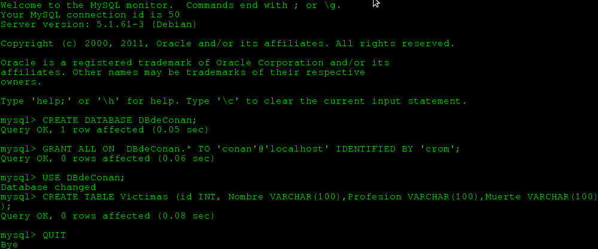

##Creando nuestra base de datos

Una vez instalado MySQL debemos crear una base de datos y un usuario para trabajar con ellos. existen multitud de herramientas e interfaces para el manejo de bases de datos MySQL que pueden usarse, tanto de texto como gráficas.

En cualquier caso, estas herramientas no son necesarias para los requerimientos de este curso y no se verán aquí.

El mínimo uso que vamos a dar a nuestra base de datos sólo requiere de un par de comandos en su propia interfaz, con lo que no es necesario ninguna herramienta especial. Evidentemente, el alumno que lo desee puede usar para ello la herramienta que prefiera, pero aquí se darán las instrucciones para el interfaz de comandos nativo de MySQL.

Las instrucciones que siguen servirán para crear tanto el usuario y la contraseña como la base de datos y la tabla que vamos a usar en los ejemplos. Estos mismos datos son los que se deben usar para el ejercicio de este tema.

El comando para entrar en el modo interactivo, que debe teclearse en un terminal o ventana de MSDOS es el siguiente:

```
mysql -u root -p 
```

Con eso entramos como root y, evidentemente, nos pedirá la contraseña que hemos elegido durante la instalación. Estos comandos pueden copiarse y pegarse directamente (sin las comillas) en el intérprete de MySQL.

Una vez introducida la contraseña, entramos en el modo interactivo y podemos ejecutar los siguientes comandos SQL en el intérprete.

```
CREATE DATABASE DBdeConan;
```

Con "CREATE DATABASE DBdeConan;" creamos una base de datos con el nombre de DBdeConan, que será la que usaremos para los ejemplos de este tema.

```
GRANT ALL ON DBdeConan.* TO 'conan'@'localhost' IDENTIFIED BY 'crom';
```

Luego, con "GRANT ALL ON DBdeConan.* TO 'conan'@'localhost' IDENTIFIED BY 'crom';", lo que hacemos es crear un usuario "conan" que tenga la contraseña "crom" y que tenga todos los permisos en la base de datos DBdeConan.

```
USE DBdeConan;
```

"USE DBdeConan;" selecciona esta base de datos para trabajar con ella en las siguientes operaciones.

```
CREATE TABLE Victimas (id INT, Nombre VARCHAR(100),Profesion VARCHAR(100),Muerte VARCHAR(100));
```

Después, "CREATE TABLE Victimas (id INT, Nombre VARCHAR(100),Profesion VARCHAR(100),Muerte VARCHAR(100));" Crea una tabla llamada Victimas con tres campos, llamados id, Nombre, Profesion y Muerte. El primero de estos (id) va a ser de tipo INTeger (entero), y el resto son cadenas de una longitud de hasta 100 caracteres.

```
QUIT
```

Por último, usamos "QUIT" para salir del intérprete de mysql.

Todo junto resulta más o menos así:



