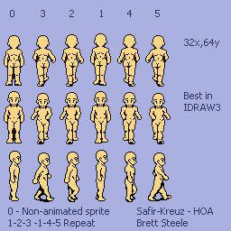

##Animando Sprites

Nuestros sprites hasta ahora pueden desplazarse, pero estaría bien que se animen un poco. Si queremos que un tipo se mueva por la pantalla, estaría bien que moviese los pies al desplazarse.

La idea es fácil: Tenemos una clase Sprite con un método update en el que podemos modificar la imagen. Sólo necesitamos cargar un array de imágenes que actuarían como fotogramas y usarlas para ir cambiando el atributo image cada cierto tiempo.

Para asegurarnos de que se mueve al ritmo que queramos, vamos a usr un reloj para que, si no han transucrrido los milisegundos que queramos, no cambie la imagen.

Para nuestra prueba usaremos (además del mismo fondo de los ejemplos anteriores) esta imagen:



Que tiene una licencia que permite su reutilización y puede encontrarse (junto con otros recursos interesantes) en [este wiki dedicado al juego **Hero of Allacros**](http://www.allacrost.org/wiki/index.php/Artwork_Categories)

Como ves, tiene varias imágenes de acciones de un mismo personaje, de las cuales recortaremos algunas (usando `subsurface`) para asignar a un array y crear nuestra animación.

> Este método de guardar varias imágenes en un mismo archivo para luego recortar las que nos interese para cada cosa es muy utilizado, y es una de las formas más cómodoas de guardar varias imágenes de un mismo personaje, lugar, elementos decorativos relacionados, etc.

Como el fondo **no** es transparente, hemos usado el método del que ya hablamos, usando `set_colorkey()` para asignar el color transparente.

Como no hay mucho más que explicar, vamos a ver un ejemplo:

```
#!/usr/bin/env python
# -*- coding: utf-8 -*-

import pygame

import sys

from pygame.locals import *

def main():

    pygame.init()

    Reloj= pygame.time.Clock()

    Ventana = pygame.display.set_mode((600, 400))
    pygame.display.set_caption("Monigotillo animado")

    Fondo = pygame.image.load("fondo.jpg")

    Imagen = pygame.image.load("monigotillo.png")
    transparente = Imagen.get_at((0, 0))
    Imagen.set_colorkey(transparente)

    MiMonigotillo = Monigotillo((300, 200), Imagen)

    while True:

        MiMonigotillo.update((300,200))

        Ventana.blit(Fondo, (0, 0))
        Ventana.blit(MiMonigotillo.image, MiMonigotillo.rect)

        pygame.display.flip()

        for evento in pygame.event.get():
            if evento.type == pygame.KEYDOWN:
                if evento.key == pygame.K_ESCAPE:
                    sys.exit()

        Reloj.tick(30)


class Monigotillo(pygame.sprite.Sprite):

    def __init__(self, coordenadas, imagen):
        pygame.sprite.Sprite.__init__(self)

        self.ImgCompleta = imagen
        a=0
        self.arrayAnim=[]
        while a < 6:
            self.arrayAnim.append(self.ImgCompleta.subsurface((a*32,100,32,64)))
            a= a + 1
        self.anim= 0

        self.actualizado = pygame.time.get_ticks()
        self.image = self.arrayAnim[self.anim]
        self.rect = self.image.get_rect()
        self.rect.center = coordenadas


    def update(self, nuevas_coordenadas):
        self.rect.center = nuevas_coordenadas
        if self.actualizado + 100 < pygame.time.get_ticks():
            self.anim= self.anim + 1
            if self.anim > 5:
                self.anim= 0
            self.image = self.arrayAnim[self.anim]
            self.actualizado= pygame.time.get_ticks()


main()
```

En esta prueba hemos usado sólo unas pocas imágenes del original. Puedes probar a modificarlo y mejorarlo añadiendo otras amimaciones y asociándolo al movimiento de la figura.

Notarás que los distintos sprites de la imagen van numerados (hay una pequeña explicación en su página). Para hacer el ejemplo más simple y autoexplicativo se ha recortado y cargado en el array directamente pero, para hacer el movimiento más fluído y realista, se deberían usar en el orden 123145 (la posición cero es para el monigote detenido). Prueba a cambiar eso y verás como la amimación funciona mucho mejor y resulta más realista. 

> Habrás notado que sólo se muestra una serie de vistas de perfil, caminando a la derecha, mientras que no hay una serie ciaminado hacia la izquierda. Esto se hace por ahorrar espacio y trabajo, ya que la imagen se puede "espejar" fácilmente usando el método `flip()` de la [librería pygame.transform](http://www.pygame.org/docs/ref/transform.html). 
