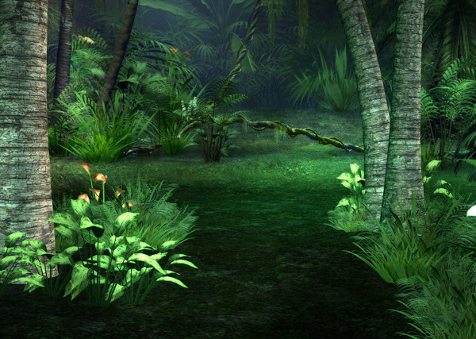

##Imágenes

El principal elemento en un juego son las imágenes. Usamos imágenes para los fondos y decorados, para los objetos estáticos o dinámicos, para los personajes o elementos de juego, para el interfaz...

Ppygame usa para todo ello el objeto *surface*, que consiste básicmante en un formato de imagen interno. Para crear tus imágnees puedes usar el porgrama gráfico que quieras, porque pygame permite importar los formatos de imagen más usuales. 

Para cargar imágenes tenemos pygame.image.load(), que importa un archivo de imagen a pygame de este modo:

```
Imagen= pygame.image.load("ruta/al/archivo/de/imagen.jpg")
```

Esto crea un objeto *surface* que podemos usar en nuestro juego.

Para posicionar un gráfico en pantalla usaremos el método blit del objeto screen, pasándole como parámetros la imagen que quremos cargar y una tupla con sus coordenadas.

```
Ventana.blit(Fondo, (0, 0))
```

> Unas notas acerca de las coordenadas:
> Las coordenadas se miden en pixels desde la esquina superior izquierda de la pantalla, e indican dónde se ubicará la esquina superior izquierda de la imagen.
> La primera corrodenada de la tupla es el eje X (hotizontal) y la segunda es el eje Y (vertical).
> Respecto al eje Z (es decir, la profundidad: qué imágenes se dibujarán encima de cuáles), las imagnes se muestran en el orden en el que se ubican con blit, de modo que las últimas se mostrarán *sobre* las anteriores.

Sólo posicionar las imágenes *no las muestra*. Hace falta indicarle a pygame que debe redibujarlas, para lo que tenemos la istrucción flip(), que se usa de este modo:

```
pygame.display.flip()
```

Vamos a ver cómo funciona todo esto junto.

Para los siguientes ejemplos vamos a usar una imagen de fondo que es obra de [Lil-Mz](http://www.deviantart.com/morelikethis/125969509) y se distribuye con una licencia Creative Commons BySA que permite su uso.



También usaremos una pequeña imagen con el logo de la [Oficina de Softwre libre de la Universidad de Granada](http://osl.ugr.es) 


> Nota que estamos usando una imagen JPG y otra PNG indistintamente, pygame se ocupa de ello por nosotros

Veamos el ejemplo ahora:

```
#!/usr/bin/env python
# -*- coding: utf-8 -*-

# Importamos la libería
import pygame

import sys

# Importamos constantes locales de pygame
from pygame.locals import *

#Inciamos pygame
pygame.init()

# Creamos un objeto screen (la ventana de juego), asginándole un alto y un ancho
Ventana = pygame.display.set_mode((600, 400))

# Le ponemos untítulo a la ventana
pygame.display.set_caption("Poniendo Imágenes")

# Cargamos las imágenes
Fondo = pygame.image.load("fondo.jpg")
Imagen = pygame.image.load("imagen.png")
# posiciona las imágenes en Ventana
Ventana.blit(Fondo, (0, 0))
Ventana.blit(Imagen, (300, 200))
# refresca los gráficos
pygame.display.flip()

# Bucle infinito para mantener el programa en ejecución
while True:
    
    # Manejador de eventos
    for evento in pygame.event.get():
        # Pulsación de la tecla escape
        if evento.type == pygame.KEYDOWN and evento.key == pygame.K_ESCAPE:
                sys.exit()
```

Hemos elegido deliberadamente una imagen en PNG porque este formato admite transparencia (el formato JPG, en cambio, no soporta transparencias).

Hacerlo así nos simplificará el trabajo, aunque pygame nos permite asignar un color como transparente, usando el método set_colorkey().

La forma más usual de hacer esto es tomar el color de la esquina superior derecha de la imagen (las coordenadas 0,0) con el método get_at() y usar ese color como transparente, de un modo parecido a esto:

```
transparente = MiImagen.get_at((0, 0))
MiImagen.set_colorkey(transparente)
```

Para que esto funcione es necesario que la imagen tenga un color de fondo uniforme y que, además, ese color no se use en el resto de la imagen (porque esa perte también se vería transparente).

Puedes usar esta imagen en formto GIF para practicar:


Un método intersante es subsurface(), que permite extraer una imagen (objeto surface) como parte de otra. Es decir, crea una imagen a partir de un "recorte" de otra mayor. Se usa de este modo:

```
ImagenTrozo = ImagenCompleta.subsurface(Rect)
```

donde Rect es un objeto *rectangle* del que más adelante veremos un poco más pero que, para lo que nos interesa ahora, es una tupla con las cuatro coordenadas del rectángulo que recortaremos para crear nuestra nueva imagen. por ejemplo:

```
Rect= (0,0,29,81)
```
Esto nos va a ser muy útil para almacenar varias imágenes relacionadas en un sólo archivo, en particular cuando veamos cómo animar sprites.

> La clase surface nos proveee de muchas más herramientas para manipular imágenes. Puedes ver más sobre ello [en su página oficial](http://www.pygame.org/docs/ref/surface.html).
