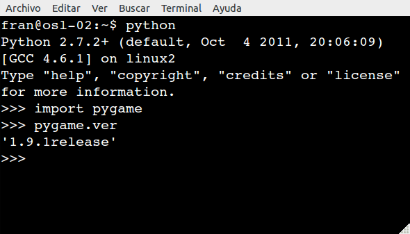

##Instalación

Para la creación de un entorno de desarrollo decente en GNU/Linux es necesario trabajar sobre una máquina con una distribución reciente. De esta manera evitaremos luchar con viejos problemas y dependencias. Para las siguientes instrucciones, se supone que se ha instalado Ubuntu 11.10 (o superior) en el equipo.

Para distribuciones basadas en debian, necesitaremos instalar el paquete python-pygame. “apt-get” se encargara de instalar las dependencias necesarias.

También lo podemos instalar con pip: sudo pip install pygame. Para comprobar que todo ha ido bien, lanzaremos las ordenes:

```
import pygame

pygame.ver
```

En la siguiente imagen podemos ver que la orden pygame.ver nos muestra la versión que estamos utilizado para la librería pygame.



Para obtener mas detalles de instalación o como instalar pyGame en equipos con otros sistemas operativos, puedes consultar el siguiente recurso: “Notas sobre la instalación”.

En caso de que la instalación se te resista, utiliza el foro que hay al final de tema para comunicarnos tus problemas y te echaremos una mano con la instalación.
